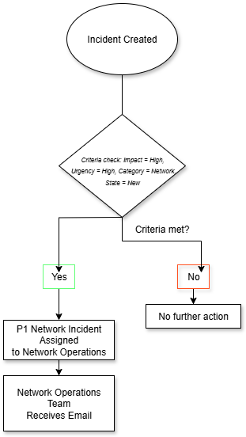

# service-now-urgent-incident-notification-workflow
Implements a ServiceNow flow that automatically assigns and triggers immediate email notifications for Priority 1 network outages, ensuring the Network Operations team is alerted and able to respond without delay.

# Workload 1: Urgent Incident Notification Workflow for Network Operations

## System Overview  
The incident notification system is designed to immediately alert the Network Operations team when a critical Priority 1 network outage occurs. It uses a Flow Designer flow that triggers whenever a new incident is created with **Impact = High**, **Urgency = High**, **Category = Network**, and **State = New**.  

As part of the workflow, the incident is automatically assigned to the Network Operations group. This step is critical because it ensures the incident is routed directly to the right team’s queue, allowing them to begin working on it immediately. The notification is then sent to the group, giving them real-time visibility while also ensuring they already have ownership of the case. Additionally, because the group now has the **itil role**, members can not only receive the notification but also access and resolve the incidents directly in ServiceNow.

## Implementation Steps
When I reviewed the original flow, I noticed several issues that prevented notifications from being sent:  
- The trigger criteria only ran when **Urgency = 2 (Medium)** instead of when the incident was truly critical.  
- It also required the Assignment group to be populated, which meant incidents without a group never triggered a notification.  
- On top of that, the Group tab in the notification record contained a number instead of a valid group record — essentially an invalid entry that didn’t exist in the system.  

To fix this, I made the following changes:  

- **Flow Criteria Update:** Modified the flow so it now triggers when  
  - `Impact = High`  
  - `Urgency = High`  
  - `Category = Network`  
  - `State = New`   

- **Update Incident Record:** Added a step in the flow to automatically assign the incident to the Network Operations group as soon as it’s created. This way, the incident is routed to the correct team’s queue right away, and the notification provides immediate visibility so they can start working without delay.

- **Notification Recipient Fix:** Replaced the invalid number in the notification record’s **“Who will receive”** field with the correct Network Operations group, so notifications would route to an actual team. 

- **Role Assignment:** Added the **itil role** to the Network Operations group so members could not only receive the notifications but also access and work the incidents directly.  

- **Testing and Validation:** Created multiple test incidents meeting the new criteria. I confirmed that emails were generated in the sys_email table and verified that the Network Operations team received them, saw the correct assignment group, and had access to work the cases.  

## Architecture Diagram  

## AI Scenario  
An AI agent could enhance this workflow by working alongside ServiceNow’s **Automatic Work Assignment (AWA)** feature. While AWA already assigns incidents based on availability and skills, AI could extend its capabilities. For example, the agent could be prompted to analyze historical resolution patterns by scanning past incidents with similar categories, priorities, and keywords. This would allow the system to recommend the best responder based not only on skills but also on proven past performance.  

The AI could also search incident descriptions, work notes, and attached knowledge articles to surface relevant documentation right when the engineer opens the case. If a recurring outage pattern is detected, the agent could highlight the likely root cause and suggest fixes that worked previously. Over time, this approach would improve routing accuracy, shorten resolution times, and make the notification system far more proactive than reactive.  
